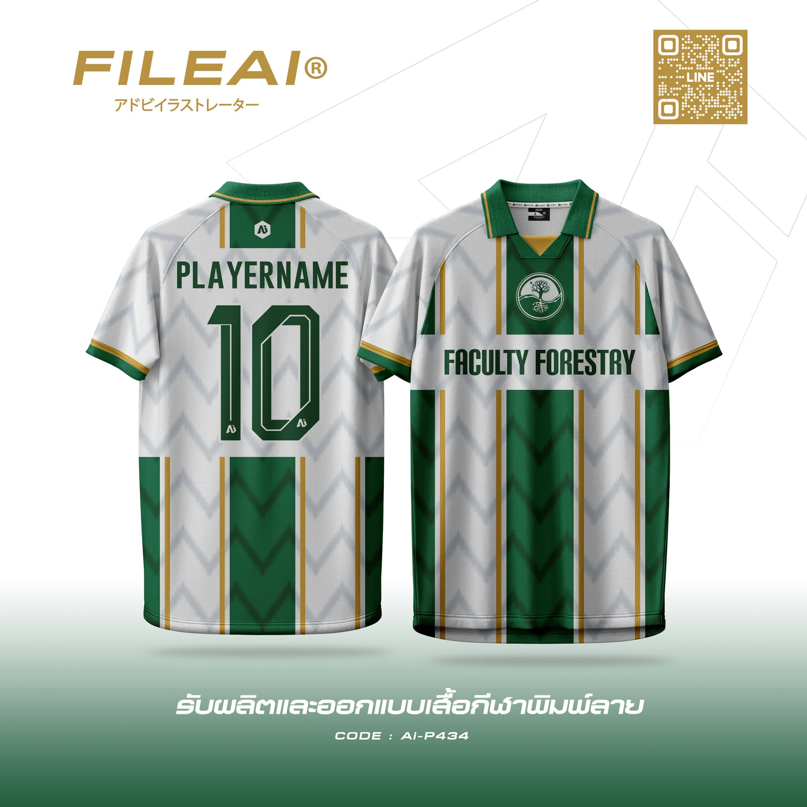
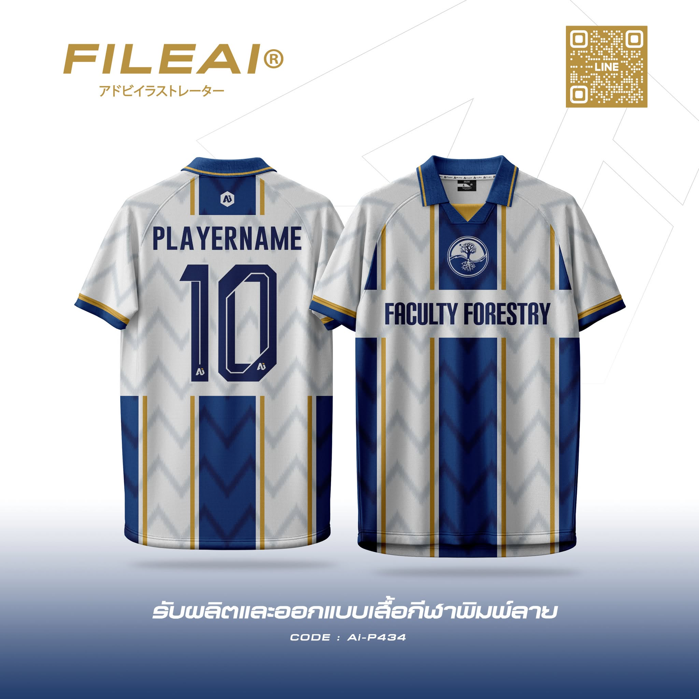
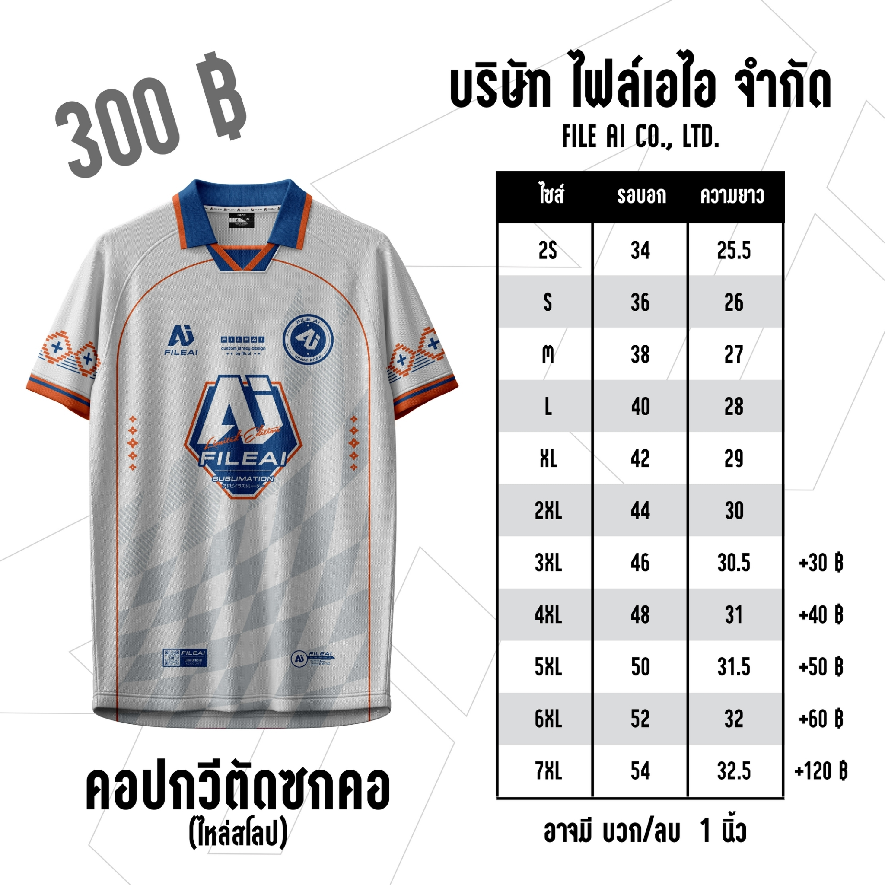

<html lang="th">
<head>
  <meta charset="UTF-8" />
  <meta name="viewport" content="width=device-width, initial-scale=1" />
  <title>Forestry | Football Club</title>
  

</head>
<body>
  <header>
    <h1>Forestry</h1>
    
footballclub

  </header>

  <section>
    <h2>Products</h2>
    

      
      
      
      
    

    <a href="order.html" class="button">Order</a>
  </section>

  <section>
    <h2>Contact</h2>
    
Instagram: <a href="#">@forestry.footballclub</a>

  </section>

  <footer>
    &copy; 2025 forestry. All rights reserved.
  </footer>
</body>
</html>
